# Backend Roadmap - Tax Dividend AI

**Version**: 1.0
**Dernière mise à jour**: 31 janvier 2026
**Auteur**: Équipe Backend
**Stack**: Spring Boot 4.0.2 | Java 25 | PostgreSQL | MinIO

---

## 📊 Vue d'Ensemble

### État Actuel (Baseline)

| Dimension | Score | Cible |
|-----------|-------|-------|
| Architecture & Code | 6.5/10 | 9.0/10 |
| Sécurité | 4.0/10 | 9.5/10 |
| Observabilité | 5.5/10 | 8.5/10 |
| Couverture Fonctionnelle | 7.2/10 | 9.0/10 |
| Test Coverage | 60% | 85% |
| Contract-First Compliance | 48% | 100% |

### Objectifs Stratégiques

1. **Production-Ready en 8 semaines** - Backend déployable en production avec sécurité grade A
2. **Contract-First 100%** - Alignement total OpenAPI spec ↔ implémentation
3. **Observabilité Grade B** - Metrics, logging, tracing opérationnels
4. **MVP Fonctionnel** - Toutes features critiques implémentées end-to-end

---

## 🎯 Organisation en 4 Phases

```
Phase 1: SÉCURITÉ & FONDATIONS (2 semaines)
  └─ Sprint 1: Security Hardening (1 sem)
  └─ Sprint 2: Contract-First Alignment (1 sem)

Phase 2: FEATURES CRITIQUES (3 semaines)
  └─ Sprint 3: PDF Generation & Auth (1.5 sem)
  └─ Sprint 4: Services Completion (1.5 sem)

Phase 3: OBSERVABILITÉ (2 semaines)
  └─ Sprint 5: Metrics & Logging (1 sem)
  └─ Sprint 6: Tracing & Monitoring (1 sem)

Phase 4: OPTIMISATION & POLISH (1 semaine)
  └─ Sprint 7: Performance & Testing (1 sem)
```

---

## 📅 PHASE 1: SÉCURITÉ & FONDATIONS (Semaines 1-2)

### Objectif
Rendre le backend sécurisé et conforme au contrat API

### Sprint 1: Security Hardening (Semaine 1)

#### 🔴 CRITIQUE - Externaliser Credentials (Jour 1)

**Fichiers concernés**:
- `src/main/resources/application.yml` (lignes 18-20, 97-101, 113-115)
- `src/main/resources/application-dev.yml` (à créer)
- `src/main/resources/application-prod.yml` (à créer)
- `.env.example` (à créer)

**Tâches**:
- [ ] Créer `.env.example` avec toutes les variables
  ```bash
  DB_HOST=localhost
  DB_PORT=5432
  DB_NAME=taxdividend_dev
  DB_USERNAME=taxdividend_user
  DB_PASSWORD=changeme

  MINIO_ENDPOINT=http://localhost:9000
  MINIO_ACCESS_KEY=changeme
  MINIO_SECRET_KEY=changeme
  MINIO_BUCKET=tax-dividend-forms

  INTERNAL_API_KEY=changeme
  JWT_SECRET_KEY=changeme

  SMTP_HOST=smtp.gmail.com
  SMTP_PORT=587
  SMTP_USERNAME=changeme
  SMTP_PASSWORD=changeme
  ```

- [ ] Modifier `application.yml` pour utiliser variables d'environnement
  ```yaml
  datasource:
    url: jdbc:postgresql://${DB_HOST:localhost}:${DB_PORT:5432}/${DB_NAME:taxdividend_dev}
    username: ${DB_USERNAME:taxdividend_user}
    password: ${DB_PASSWORD}

  storage:
    s3:
      endpoint: ${MINIO_ENDPOINT:http://localhost:9000}
      access-key: ${MINIO_ACCESS_KEY}
      secret-key: ${MINIO_SECRET_KEY}
      bucket-name: ${MINIO_BUCKET:tax-dividend-forms}

  app:
    security:
      internal-api-key: ${INTERNAL_API_KEY}
      jwt-secret: ${JWT_SECRET_KEY}
  ```

- [ ] Créer `application-prod.yml` avec logging INFO (pas DEBUG)
- [ ] Mettre à jour `.gitignore` (ajouter `.env`)
- [ ] Documenter dans README.md la configuration des variables

**Critères d'acceptation**:
- ✅ Aucun credential en dur dans `application.yml`
- ✅ Application démarre avec `.env` non présent (valeurs par défaut)
- ✅ Application démarre avec `.env` présent (valeurs overridées)

**Effort**: 4h
**Priorité**: 🔴 CRITIQUE

---

#### 🔴 CRITIQUE - Implémenter Validation JWT (Jours 1-2)

**Fichiers concernés**:
- `src/main/java/com/taxdividend/backend/config/InternalSecurityConfig.java` (lignes 122-150)
- `src/main/java/com/taxdividend/backend/security/JwtService.java` (à créer)
- `src/main/java/com/taxdividend/backend/security/UserContext.java` (modifier)

**Problème actuel**:
```java
// Actuellement: simple Base64 decode, pas de validation
byte[] decodedBytes = Base64.getDecoder().decode(contextHeader);
UserContext userContext = objectMapper.readValue(decodedBytes, UserContext.class);
// ❌ N'importe qui peut forger ce header !
```

**Tâches**:
- [ ] Créer `JwtService` avec HMAC-SHA256
  ```java
  @Service
  public class JwtService {

      @Value("${app.security.jwt-secret}")
      private String secretKey;

      public UserContext validateAndDecode(String jwtToken) throws JwtException {
          try {
              // 1. Vérifier signature
              SecretKey key = Keys.hmacShaKeyFor(secretKey.getBytes(StandardCharsets.UTF_8));

              // 2. Parser et valider
              Jws<Claims> jws = Jwts.parserBuilder()
                  .setSigningKey(key)
                  .build()
                  .parseClaimsJws(jwtToken);

              Claims claims = jws.getBody();

              // 3. Vérifier expiration
              if (claims.getExpiration().before(new Date())) {
                  throw new JwtException("Token expired");
              }

              // 4. Extraire UserContext
              return UserContext.builder()
                  .userId(UUID.fromString(claims.getSubject()))
                  .email(claims.get("email", String.class))
                  .roles(claims.get("roles", List.class))
                  .build();

          } catch (JwtException e) {
              log.error("JWT validation failed", e);
              throw e;
          }
      }
  }
  ```

- [ ] Modifier `UserContext` pour ajouter timestamp
  ```java
  @Data
  @Builder
  public class UserContext {
      private UUID userId;
      private String email;
      private List<String> roles;
      private Instant issuedAt;    // Nouveau
      private Instant expiresAt;   // Nouveau
  }
  ```

- [ ] Modifier `InternalSecurityFilter` pour utiliser `JwtService`
  ```java
  @Override
  protected void doFilterInternal(HttpServletRequest request, ...) {
      String jwtHeader = request.getHeader("X-User-Context");

      if (jwtHeader != null && jwtHeader.startsWith("Bearer ")) {
          String jwt = jwtHeader.substring(7);

          try {
              UserContext userContext = jwtService.validateAndDecode(jwt);
              request.setAttribute("userContext", userContext);
          } catch (JwtException e) {
              response.sendError(HttpServletResponse.SC_UNAUTHORIZED, "Invalid JWT");
              return;
          }
      }

      chain.doFilter(request, response);
  }
  ```

- [ ] Ajouter dépendance Maven
  ```xml
  <dependency>
      <groupId>io.jsonwebtoken</groupId>
      <artifactId>jjwt-api</artifactId>
      <version>0.12.5</version>
  </dependency>
  <dependency>
      <groupId>io.jsonwebtoken</groupId>
      <artifactId>jjwt-impl</artifactId>
      <version>0.12.5</version>
      <scope>runtime</scope>
  </dependency>
  <dependency>
      <groupId>io.jsonwebtoken</groupId>
      <artifactId>jjwt-jackson</artifactId>
      <version>0.12.5</version>
      <scope>runtime</scope>
  </dependency>
  ```

- [ ] Créer tests unitaires `JwtServiceTest`
- [ ] Créer tests d'intégration pour validation JWT

**Critères d'acceptation**:
- ✅ JWT avec signature invalide rejeté (401)
- ✅ JWT expiré rejeté (401)
- ✅ JWT valide accepté et UserContext injecté
- ✅ Tests unitaires passent (coverage 85%+)

**Effort**: 8h
**Priorité**: 🔴 CRITIQUE
**Dépendances**: Task "Externaliser Credentials" (pour JWT_SECRET_KEY)

---

#### 🔴 CRITIQUE - Sécuriser Actuator Endpoints (Jour 3)

**Fichiers concernés**:
- `src/main/java/com/taxdividend/backend/config/SecurityConfig.java` (à créer ou modifier)
- `src/main/resources/application.yml` (lignes 62-75)

**Problème actuel**:
- `/actuator/metrics` exposé publiquement
- `/actuator/prometheus` exposé publiquement
- Données sensibles potentiellement leakées

**Tâches**:
- [ ] Modifier `application.yml`
  ```yaml
  management:
    endpoints:
      web:
        exposure:
          include: health,prometheus  # Limité
          exclude: shutdown,threaddump,heapdump
        base-path: /actuator
    endpoint:
      health:
        show-details: when-authorized  # Pas always!
        roles: ROLE_ADMIN
      prometheus:
        enabled: true
  ```

- [ ] Créer/Modifier `SecurityConfig` pour protéger actuator
  ```java
  @Configuration
  @EnableWebSecurity
  public class SecurityConfig {

      @Bean
      public SecurityFilterChain actuatorSecurityFilterChain(HttpSecurity http) throws Exception {
          http
              .securityMatcher("/actuator/**")
              .authorizeHttpRequests(authz -> authz
                  .requestMatchers("/actuator/health/**").permitAll()
                  .requestMatchers("/actuator/prometheus").hasRole("PROMETHEUS")
                  .requestMatchers("/actuator/**").hasRole("ADMIN")
              )
              .httpBasic(Customizer.withDefaults());

          return http.build();
      }
  }
  ```

- [ ] Ajouter configuration pour users admin
  ```yaml
  spring:
    security:
      user:
        name: ${ACTUATOR_USERNAME:admin}
        password: ${ACTUATOR_PASSWORD}
        roles: ADMIN,PROMETHEUS
  ```

- [ ] Tester accès non autorisé retourne 401
- [ ] Tester accès avec credentials retourne 200

**Critères d'acceptation**:
- ✅ `/actuator/health` accessible sans auth
- ✅ `/actuator/metrics` retourne 401 sans auth
- ✅ `/actuator/prometheus` retourne 401 sans auth
- ✅ Accès avec credentials valides fonctionne

**Effort**: 3h
**Priorité**: 🔴 CRITIQUE

---

#### 🔴 CRITIQUE - Corriger Migration Flyway (Jour 3)

**Fichier concerné**:
- `src/main/resources/db/migration/V1__init_schema.sql`

**Problème**: La fonction `uuid_generate_v4()` nécessite l'extension PostgreSQL `uuid-ossp`

**Tâches**:
- [ ] Ajouter au début de `V1__init_schema.sql` (ligne 1)
  ```sql
  -- Enable UUID extension
  CREATE EXTENSION IF NOT EXISTS "uuid-ossp";
  ```

- [ ] Tester migration sur base vierge
  ```bash
  docker-compose down -v
  docker-compose up -d postgres
  mvn flyway:migrate
  ```

- [ ] Vérifier tables créées avec UUIDs

**Critères d'acceptation**:
- ✅ Migration réussit sans erreur sur DB vierge
- ✅ Tables créées avec colonnes UUID
- ✅ Contraintes et indexes appliqués

**Effort**: 1h
**Priorité**: 🔴 CRITIQUE

---

#### 🟡 IMPORTANT - Implémenter AuthController Complet (Jours 4-5)

**Fichiers concernés**:
- `src/main/java/com/taxdividend/backend/controller/AuthController.java`
- `src/main/java/com/taxdividend/backend/service/UserService.java` (à créer)
- `src/main/java/com/taxdividend/backend/service/impl/UserServiceImpl.java` (à créer)
- `src/main/java/com/taxdividend/backend/service/EmailService.java` (modifier)

**Problème actuel**: AuthController est un stub complet (ligne 37 TODO)

**Tâches**:

1. **Créer UserService** (4h)
   ```java
   public interface UserService {
       RegisterUser200Response registerUser(RegisterUserRequest request);
       void sendVerificationEmail(UUID userId, String email);
       VerifyEmailResponse verifyEmail(String token);
       Optional<User> findByEmail(String email);
       boolean isEmailTaken(String email);
   }
   ```

2. **Implémenter UserServiceImpl** (6h)
   - [ ] Validation email format (regex)
   - [ ] Vérifier unicité email
   - [ ] Hash password avec BCryptPasswordEncoder
   - [ ] Générer token de vérification (UUID)
   - [ ] Sauvegarder User dans DB
   - [ ] Appeler EmailService pour envoi

   ```java
   @Service
   @RequiredArgsConstructor
   public class UserServiceImpl implements UserService {

       private final UserRepository userRepository;
       private final EmailService emailService;
       private final PasswordEncoder passwordEncoder;

       @Override
       @Transactional
       public RegisterUser200Response registerUser(RegisterUserRequest request) {
           // 1. Valider email
           if (!isValidEmail(request.getEmail())) {
               throw new IllegalArgumentException("Invalid email format");
           }

           // 2. Vérifier unicité
           if (isEmailTaken(request.getEmail())) {
               throw new DuplicateEmailException("Email already registered");
           }

           // 3. Créer user
           User user = User.builder()
               .id(UUID.randomUUID())
               .email(request.getEmail())
               .passwordHash(passwordEncoder.encode(request.getPassword()))
               .country("CH") // Default
               .emailVerified(false)
               .verificationToken(UUID.randomUUID().toString())
               .createdAt(LocalDateTime.now())
               .build();

           userRepository.save(user);

           // 4. Envoyer email vérification
           sendVerificationEmail(user.getId(), user.getEmail());

           // 5. Retourner réponse
           return new RegisterUser200Response()
               .userId(user.getId())
               .message("Verification email sent");
       }

       private boolean isValidEmail(String email) {
           String regex = "^[A-Za-z0-9+_.-]+@[A-Za-z0-9.-]+\\.[A-Za-z]{2,}$";
           return email != null && email.matches(regex);
       }
   }
   ```

3. **Créer PasswordEncoder Bean** (1h)
   ```java
   @Configuration
   public class SecurityConfig {
       @Bean
       public PasswordEncoder passwordEncoder() {
           return new BCryptPasswordEncoder(12); // Strength 12
       }
   }
   ```

4. **Implémenter EmailService.sendVerificationEmail** (3h)
   ```java
   @Service
   @RequiredArgsConstructor
   public class EmailService {

       private final JavaMailSender mailSender;

       @Value("${app.frontend.url}")
       private String frontendUrl;

       public void sendVerificationEmail(String toEmail, String token) {
           try {
               MimeMessage message = mailSender.createMimeMessage();
               MimeMessageHelper helper = new MimeMessageHelper(message, true);

               helper.setTo(toEmail);
               helper.setSubject("Verify your Tax Dividend account");

               String verificationUrl = frontendUrl + "/verify-email?token=" + token;
               String htmlContent = buildEmailTemplate(verificationUrl);
               helper.setText(htmlContent, true);

               mailSender.send(message);
               log.info("Verification email sent to {}", toEmail);

           } catch (MessagingException e) {
               log.error("Failed to send email to {}", toEmail, e);
               throw new EmailSendException("Failed to send verification email", e);
           }
       }

       private String buildEmailTemplate(String url) {
           return """
               <html>
               <body>
                   <h2>Welcome to Tax Dividend!</h2>
                   <p>Please verify your email by clicking the link below:</p>
                   <a href="%s">Verify Email</a>
                   <p>This link expires in 24 hours.</p>
               </body>
               </html>
               """.formatted(url);
       }
   }
   ```

5. **Modifier AuthController** (2h)
   ```java
   @Override
   public ResponseEntity<RegisterUser200Response> registerUser(RegisterUserRequest request) {
       try {
           RegisterUser200Response response = userService.registerUser(request);
           return ResponseEntity.ok(response);
       } catch (DuplicateEmailException e) {
           return ResponseEntity.status(HttpStatus.CONFLICT).build();
       } catch (IllegalArgumentException e) {
           return ResponseEntity.badRequest().build();
       }
   }
   ```

6. **Créer tests** (4h)
   - [ ] UserServiceTest (unitaire)
   - [ ] AuthControllerTest (intégration)
   - [ ] Test email déjà pris → 409 Conflict
   - [ ] Test email invalide → 400 Bad Request
   - [ ] Test registration réussie → 200 OK

**Critères d'acceptation**:
- ✅ User créé en DB avec password hashé
- ✅ Email de vérification envoyé
- ✅ Email dupliqué retourne 409
- ✅ Email invalide retourne 400
- ✅ Tests passent (coverage 80%+)

**Effort**: 20h (2.5 jours)
**Priorité**: 🟡 IMPORTANT
**Dépendances**: Migration Flyway corrigée

---

### Sprint 2: Contract-First Alignment (Semaine 2)

#### 🔴 CRITIQUE - Mettre à jour OpenAPI Spec (Jours 1-2)

**Fichier concerné**:
- `specs/backend/openapi.yaml`

**Objectif**: Ajouter les 16 endpoints implémentés mais manquants dans le spec

**Tâches**:

1. **Ajouter endpoints DividendController** (3 endpoints)
   ```yaml
   paths:
     /internal/dividends/calculate-all:
       post:
         tags:
           - Dividends
         operationId: calculateAllUserDividends
         summary: Calculate tax for all user dividends
         parameters:
           - name: X-User-Id
             in: header
             required: true
             schema:
               type: string
               format: uuid
         responses:
           '200':
             description: Calculation results
             content:
               application/json:
                 schema:
                   $ref: '#/components/schemas/TaxCalculationBatchResultDto'

     /internal/dividends/by-date-range:
       get:
         tags:
           - Dividends
         operationId: getDividendsByDateRange
         summary: Get dividends by date range
         parameters:
           - name: X-User-Id
             in: header
             required: true
             schema:
               type: string
               format: uuid
           - name: startDate
             in: query
             required: true
             schema:
               type: string
               format: date
           - name: endDate
             in: query
             required: true
             schema:
               type: string
               format: date
         responses:
           '200':
             description: List of dividends
             content:
               application/json:
                 schema:
                   type: array
                   items:
                     $ref: '#/components/schemas/Dividend'

     /internal/dividends/unsubmitted:
       get:
         tags:
           - Dividends
         operationId: getUnsubmittedDividends
         summary: Get unsubmitted dividends
         parameters:
           - name: X-User-Id
             in: header
             required: true
             schema:
               type: string
               format: uuid
         responses:
           '200':
             description: List of unsubmitted dividends
             content:
               application/json:
                 schema:
                   type: array
                   items:
                     $ref: '#/components/schemas/Dividend'
   ```

2. **Ajouter endpoints FormController** (3 endpoints)
   ```yaml
   /internal/forms/{id}/download-url:
     get:
       tags:
         - Forms
       operationId: getDownloadUrl
       summary: Get presigned download URL
       parameters:
         - name: id
           in: path
           required: true
           schema:
             type: string
             format: uuid
         - name: X-User-Id
           in: header
           required: true
           schema:
             type: string
             format: uuid
         - name: expirationHours
           in: query
           required: false
           schema:
             type: integer
             default: 24
       responses:
         '200':
           description: Presigned URL
           content:
             text/plain:
               schema:
                 type: string
         '404':
           description: Form not found

   /internal/forms/{id}/regenerate:
     post:
       tags:
         - Forms
       operationId: regenerateForm
       summary: Regenerate expired form
       # ... (similaire)

   /internal/forms/generate-all-unsubmitted:
     post:
       tags:
         - Forms
       operationId: generateForAllUnsubmitted
       summary: Generate forms for all unsubmitted dividends
       # ... (similaire)
   ```

3. **Ajouter endpoints TaxRuleController** (9 endpoints)
   ```yaml
   /tax-rules/by-countries:
     get:
       tags:
         - TaxRules
       operationId: getRulesBetweenCountries
       summary: Get rules between two countries
       parameters:
         - name: sourceCountry
           in: query
           required: true
           schema:
             type: string
         - name: residenceCountry
           in: query
           required: true
           schema:
             type: string
       responses:
         '200':
           description: List of tax rules
           content:
             application/json:
               schema:
                 type: array
                 items:
                   $ref: '#/components/schemas/TaxRule'

   /tax-rules/active:
     get:
       tags:
         - TaxRules
       operationId: getActiveRules
       # ... (similaire pour expired, by-source-country, etc.)
   ```

4. **Ajouter endpoints HealthController** (1 endpoint custom)
   ```yaml
   /internal/health/deep:
     get:
       tags:
         - Health
       operationId: deepHealthCheck
       summary: Deep health check with component details
       responses:
         '200':
           description: Health check results
           content:
             application/json:
               schema:
                 $ref: '#/components/schemas/HealthCheckResponse'
   ```

- [ ] Valider OpenAPI spec avec `mvn validate`
- [ ] Générer interfaces avec `mvn generate-sources`
- [ ] Vérifier compilation réussit

**Critères d'acceptation**:
- ✅ Spec OpenAPI valide (pas d'erreurs)
- ✅ Interfaces générées (target/generated-sources/openapi/)
- ✅ Compilation réussit sans erreurs

**Effort**: 12h
**Priorité**: 🔴 CRITIQUE

---

#### 🟡 IMPORTANT - Décommenter TaxRuleController (Jour 3)

**Fichier concerné**:
- `src/main/java/com/taxdividend/backend/controller/TaxRuleController.java` (lignes 84-228)

**Tâches**:
- [ ] Décommenter les 9 méthodes
- [ ] Supprimer les annotations `@GetMapping` (remplacées par interface générée)
- [ ] Implémenter les méthodes en appelant TaxRuleService

Exemple:
```java
// Avant:
// @GetMapping("/by-countries")
// public ResponseEntity<List<TaxRule>> getRulesBetweenCountries(...) {

// Après:
@Override
public ResponseEntity<List<com.taxdividend.backend.api.dto.TaxRule>> getRulesBetweenCountries(
        String sourceCountry,
        String residenceCountry) {

    List<com.taxdividend.backend.api.dto.TaxRule> rules =
        taxRuleService.getRulesBetweenCountries(sourceCountry, residenceCountry);

    log.info("Found {} tax rules between {} and {}", rules.size(), sourceCountry, residenceCountry);

    return ResponseEntity.ok(rules);
}
```

**Critères d'acceptation**:
- ✅ Code compile sans erreurs
- ✅ Controller implémente toutes méthodes TaxRulesApi
- ✅ Endpoints répondent correctement

**Effort**: 4h
**Priorité**: 🟡 IMPORTANT
**Dépendances**: OpenAPI spec mise à jour

---

#### 🟡 IMPORTANT - Réactiver Tests Désactivés (Jours 4-5)

**Fichiers concernés**:
- `src/test/java/com/taxdividend/backend/controller/DividendControllerTest.java` (3 tests)
- `src/test/java/com/taxdividend/backend/controller/FormControllerTest.java` (6 tests)
- `src/test/java/com/taxdividend/backend/controller/HealthControllerTest.java` (7 tests)
- `src/test/java/com/taxdividend/backend/controller/TaxRuleControllerTest.java` (13 tests)

**Tâches**:
- [ ] Supprimer annotations `@Disabled` sur 29 tests
- [ ] Corriger les tests qui échouent
- [ ] Ajouter les mocks manquants
- [ ] Valider tous tests passent

**Exemples de corrections**:

1. **DividendControllerTest.shouldCalculateAllUserDividends**
   ```java
   // Supprimer @Disabled
   @Test
   @DisplayName("Should calculate all user's dividends")
   void shouldCalculateAllUserDividends() throws Exception {
       // Given
       TaxCalculationBatchResultDto result = TaxCalculationBatchResultDto.builder()
           .successCount(5)
           .failureCount(0)
           .totalReclaimableAmount(new BigDecimal("100.00"))
           .build();

       when(taxCalculationService.calculateAndUpdateForUser(testUserId))
           .thenReturn(result);

       // When/Then
       mockMvc.perform(post("/internal/dividends/calculate-all")
                   .header("X-User-Id", testUserId.toString()))
           .andExpect(status().isOk())
           .andExpect(jsonPath("$.successCount").value(5));

       verify(taxCalculationService).calculateAndUpdateForUser(testUserId);
   }
   ```

2. **TaxRuleControllerTest - Fixer problème WebMvcTest avec @RequestParam**

   Option A: Migrer vers @SpringBootTest pour ces 4 tests
   ```java
   @SpringBootTest
   @AutoConfigureMockMvc
   class TaxRuleControllerIntegrationTest {

       @Autowired
       private MockMvc mockMvc;

       @MockBean
       private TaxRuleService taxRuleService;

       @Test
       void shouldFindApplicableRule() throws Exception {
           // Test avec @RequestParam fonctionne maintenant
       }
   }
   ```

   Option B: Investiguer pourquoi WebMvcTest ne trouve pas les endpoints avec @RequestParam

- [ ] Exécuter tous les tests: `mvn test`
- [ ] Vérifier 0 failures, 0 errors

**Critères d'acceptation**:
- ✅ 0 tests désactivés (`@Disabled` supprimé)
- ✅ Tous tests passent (60 tests actifs)
- ✅ Coverage maintenu à 60%+

**Effort**: 16h (2 jours)
**Priorité**: 🟡 IMPORTANT
**Dépendances**: OpenAPI spec + TaxRuleController décommenté

---

## 📅 PHASE 2: FEATURES CRITIQUES (Semaines 3-5)

### Sprint 3: PDF Generation & Performance (Semaine 3 + 2 jours semaine 4)

#### 🔴 CRITIQUE - Implémenter Vrai PdfGenerationService (Jours 1-5)

**Fichier concerné**:
- `src/main/java/com/taxdividend/backend/service/impl/PdfGenerationServiceImpl.java`

**Objectif**: Remplir les formulaires officiels 5000/5001 au lieu de générer des PDFs basiques

**Contexte**:
- Formulaires officiels: `/docs/officials/fr/form-5000.pdf` et `form-5001.pdf`
- Ces formulaires ont des champs AcroForm à remplir
- Utiliser PDFBox pour manipulation

**Tâches**:

1. **Charger PDF Templates** (2h)
   ```java
   @Service
   @RequiredArgsConstructor
   public class PdfGenerationServiceImpl implements PdfGenerationService {

       @Value("${app.pdf.templates.form5000}")
       private String form5000TemplatePath;

       @Value("${app.pdf.templates.form5001}")
       private String form5001TemplatePath;

       private PDDocument loadTemplate(String templatePath) throws IOException {
           try (InputStream is = new ClassPathResource(templatePath).getInputStream()) {
               return PDDocument.load(is);
           }
       }
   }
   ```

2. **Implémenter Form 5000 (Attestation Résidence)** (8h)
   ```java
   private byte[] createForm5000Pdf(User user, Integer taxYear) throws IOException {
       PDDocument document = loadTemplate(form5000TemplatePath);

       try {
           PDAcroForm acroForm = document.getDocumentCatalog().getAcroForm();

           if (acroForm != null) {
               // Remplir champs formulaire
               acroForm.getField("nom").setValue(user.getLastName());
               acroForm.getField("prenom").setValue(user.getFirstName());
               acroForm.getField("adresse").setValue(user.getAddress());
               acroForm.getField("ville").setValue(user.getCity());
               acroForm.getField("code_postal").setValue(user.getPostalCode());
               acroForm.getField("pays").setValue("Suisse");
               acroForm.getField("annee_fiscale").setValue(String.valueOf(taxYear));

               // Date du jour
               acroForm.getField("date").setValue(
                   LocalDate.now().format(DateTimeFormatter.ofPattern("dd/MM/yyyy"))
               );

               // Flatten form (rendre non éditable)
               acroForm.flatten();
           }

           ByteArrayOutputStream baos = new ByteArrayOutputStream();
           document.save(baos);
           return baos.toByteArray();

       } finally {
           document.close();
       }
   }
   ```

3. **Implémenter Form 5001 (Liquidation Dividendes)** (12h)
   ```java
   private byte[] createForm5001Pdf(User user, List<Dividend> dividends, Integer taxYear)
           throws IOException {

       PDDocument document = loadTemplate(form5001TemplatePath);

       try {
           PDAcroForm acroForm = document.getDocumentCatalog().getAcroForm();

           if (acroForm != null) {
               // Infos contribuable
               acroForm.getField("nom").setValue(user.getLastName());
               acroForm.getField("prenom").setValue(user.getFirstName());
               // ...

               // Tableau des dividendes (lignes 1-10)
               for (int i = 0; i < Math.min(dividends.size(), 10); i++) {
                   Dividend div = dividends.get(i);

                   acroForm.getField("ligne_" + (i+1) + "_societe")
                       .setValue(div.getSecurityName());

                   acroForm.getField("ligne_" + (i+1) + "_isin")
                       .setValue(div.getIsin());

                   acroForm.getField("ligne_" + (i+1) + "_date")
                       .setValue(div.getPaymentDate().format(
                           DateTimeFormatter.ofPattern("dd/MM/yyyy")));

                   acroForm.getField("ligne_" + (i+1) + "_montant_brut")
                       .setValue(formatAmount(div.getGrossAmount()));

                   acroForm.getField("ligne_" + (i+1) + "_retenue_source")
                       .setValue(formatAmount(div.getWithholdingTax()));

                   acroForm.getField("ligne_" + (i+1) + "_montant_recuperable")
                       .setValue(formatAmount(div.getReclaimableAmount()));
               }

               // Totaux
               BigDecimal totalGross = dividends.stream()
                   .map(Dividend::getGrossAmount)
                   .reduce(BigDecimal.ZERO, BigDecimal::add);

               BigDecimal totalReclaimable = dividends.stream()
                   .map(Dividend::getReclaimableAmount)
                   .reduce(BigDecimal.ZERO, BigDecimal::add);

               acroForm.getField("total_brut").setValue(formatAmount(totalGross));
               acroForm.getField("total_recuperable").setValue(formatAmount(totalReclaimable));

               acroForm.flatten();
           }

           // Si plus de 10 dividendes, créer pages supplémentaires
           if (dividends.size() > 10) {
               addSupplementaryPages(document, dividends.subList(10, dividends.size()), user);
           }

           ByteArrayOutputStream baos = new ByteArrayOutputStream();
           document.save(baos);
           return baos.toByteArray();

       } finally {
           document.close();
       }
   }

   private String formatAmount(BigDecimal amount) {
       return amount.setScale(2, RoundingMode.HALF_UP).toString();
   }
   ```

4. **Gérer cas > 10 dividendes** (4h)
   - Form 5001 a max 10 lignes
   - Créer pages supplémentaires si nécessaire
   - Ou générer plusieurs Form 5001

5. **Tester avec vrais formulaires** (4h)
   - [ ] Télécharger vrais forms 5000/5001 depuis impots.gouv.fr
   - [ ] Placer dans `src/main/resources/templates/pdf/`
   - [ ] Identifier noms des champs AcroForm (avec PDFBox)
   - [ ] Valider PDF généré est lisible et valide

6. **Ajouter validation** (2h)
   - [ ] Vérifier tous champs obligatoires remplis
   - [ ] Valider format dates/montants
   - [ ] Logger warnings si champs manquants

**Critères d'acceptation**:
- ✅ Form 5000 généré avec champs remplis
- ✅ Form 5001 généré avec dividendes (max 10)
- ✅ PDFs lisibles et validés manuellement
- ✅ Cas > 10 dividendes géré correctement
- ✅ Tests d'intégration passent

**Effort**: 32h (4 jours)
**Priorité**: 🔴 CRITIQUE

---

#### 🟡 IMPORTANT - Optimiser Pagination (Jours 6-7)

**Fichiers concernés**:
- `src/main/java/com/taxdividend/backend/repository/DividendRepository.java`
- `src/main/java/com/taxdividend/backend/service/impl/DividendServiceImpl.java` (lignes 32-67)
- `src/main/java/com/taxdividend/backend/repository/GeneratedFormRepository.java`
- `src/main/java/com/taxdividend/backend/service/impl/FormServiceImpl.java` (lignes 148-181)

**Problème**: Charge TOUS les résultats en mémoire avant pagination

**Tâches**:

1. **DividendRepository** (1h)
   ```java
   // Avant:
   List<Dividend> findByUserId(UUID userId);

   // Après:
   Page<Dividend> findByUserId(UUID userId, Pageable pageable);
   ```

2. **DividendServiceImpl** (1h)
   ```java
   // Avant:
   public ListDividends200Response listDividends(UUID userId, Pageable pageable) {
       List<Dividend> dividends = dividendRepository.findByUserId(userId);
       Page<Dividend> dividendPage = PageableExecutionUtils.getPage(
           dividends, pageable, dividends::size);  // ❌ Charge tout en mémoire
       return dividendMapper.toPageResponse(dividendPage);
   }

   // Après:
   public ListDividends200Response listDividends(UUID userId, Pageable pageable) {
       Page<Dividend> dividendPage = dividendRepository.findByUserId(userId, pageable);
       return dividendMapper.toPageResponse(dividendPage);
   }
   ```

3. **GeneratedFormRepository** (1h)
   ```java
   // Ajouter méthode:
   List<GeneratedForm> findByUserIdAndStatus(UUID userId, String status);
   ```

4. **FormServiceImpl** (1h)
   ```java
   // Avant:
   public List<GeneratedForm> getFormsByStatus(UUID userId, String status) {
       List<GeneratedForm> userForms = generatedFormRepository.findByUserId(userId);
       return userForms.stream()
           .filter(f -> status.equalsIgnoreCase(f.getStatus()))
           .map(formMapper::toApiDto)
           .toList();  // ❌ Filtre en mémoire
   }

   // Après:
   public List<GeneratedForm> getFormsByStatus(UUID userId, String status) {
       return generatedFormRepository.findByUserIdAndStatus(userId, status)
           .stream()
           .map(formMapper::toApiDto)
           .toList();
   }
   ```

5. **Tester avec données volumineuses** (4h)
   - [ ] Créer script SQL pour insérer 10 000 dividends
   - [ ] Tester requête `GET /dividends?page=0&size=20`
   - [ ] Valider temps réponse < 200ms
   - [ ] Valider mémoire utilisée réduite

**Critères d'acceptation**:
- ✅ Requête paginated ne charge que page demandée
- ✅ Performance < 200ms pour 10k+ résultats
- ✅ Tests d'intégration avec Testcontainers passent

**Effort**: 8h (1 jour)
**Priorité**: 🟡 IMPORTANT

---

### Sprint 4: Services Completion (Semaine 4 fin + Semaine 5)

#### 🟡 IMPORTANT - Compléter Mappers (Jours 1-2)

**Fichiers concernés**:
- `src/main/java/com/taxdividend/backend/mapper/DividendMapper.java` (lignes 16-32)
- `src/main/java/com/taxdividend/backend/mapper/FormMapper.java` (lignes 15-40)
- `src/main/java/com/taxdividend/backend/mapper/TaxRuleMapper.java`

**Tâches**:

1. **DividendMapper - Ajouter champs manquants** (2h)
   ```java
   public Dividend toDto(com.taxdividend.backend.model.Dividend entity) {
       Dividend dto = new Dividend();
       dto.setId(entity.getId());
       dto.setSecurityName(entity.getSecurityName());
       dto.setIsin(entity.getIsin());
       dto.setGrossAmount(entity.getGrossAmount());
       dto.setCurrency(entity.getCurrency());
       dto.setPaymentDate(entity.getPaymentDate());
       dto.setWithholdingTax(entity.getWithholdingTax());
       dto.setReclaimableAmount(entity.getReclaimableAmount());

       // ✅ NOUVEAUX:
       dto.setWithholdingRate(entity.getWithholdingRate());
       dto.setTreatyRate(entity.getTreatyRate());
       dto.setSourceCountry(entity.getSourceCountry());
       dto.setSecurityType(entity.getSecurityType());
       dto.setSubmitted(entity.isSubmitted());
       dto.setFormId(entity.getFormId());

       return dto;
   }
   ```

2. **FormMapper - Ajouter champs manquants** (2h)
   ```java
   public GeneratedForm toApiDto(com.taxdividend.backend.model.GeneratedForm entity) {
       GeneratedForm api = new GeneratedForm();
       api.setId(entity.getId());
       api.setFormType(entity.getFormType());
       api.setStoragePath(entity.getStoragePath());
       api.setGeneratedAt(entity.getGeneratedAt());

       // ✅ NOUVEAUX:
       api.setStatus(entity.getStatus());
       api.setMetadata(entity.getMetadata()); // JSON metadata
       api.setFileSize(entity.getFileSize());
       api.setChecksumSha256(entity.getChecksumSha256());

       return api;
   }
   ```

3. **Vérifier TaxRuleMapper complet** (1h)

4. **Ajouter tests unitaires mappers** (3h)
   ```java
   class DividendMapperTest {

       private DividendMapper mapper = new DividendMapperImpl();

       @Test
       void shouldMapAllFieldsEntityToDto() {
           // Given
           com.taxdividend.backend.model.Dividend entity = createFullDividendEntity();

           // When
           Dividend dto = mapper.toDto(entity);

           // Then
           assertThat(dto.getId()).isEqualTo(entity.getId());
           assertThat(dto.getWithholdingRate()).isEqualTo(entity.getWithholdingRate());
           assertThat(dto.getTreatyRate()).isEqualTo(entity.getTreatyRate());
           assertThat(dto.getSourceCountry()).isEqualTo(entity.getSourceCountry());
           // ... tous les champs
       }
   }
   ```

**Critères d'acceptation**:
- ✅ Tous champs entity mappés vers DTO
- ✅ Tests unitaires passent (coverage 90%+)
- ✅ Pas de champs null non attendus

**Effort**: 8h (1 jour)
**Priorité**: 🟡 IMPORTANT

---

#### 🟢 NICE-TO-HAVE - Implémenter Rate Limiting (Jours 3-4)

**Objectif**: Protéger endpoints critiques contre abus

**Tâches**:

1. **Ajouter dépendance Resilience4j** (30min)
   ```xml
   <dependency>
       <groupId>io.github.resilience4j</groupId>
       <artifactId>resilience4j-spring-boot3</artifactId>
       <version>2.1.0</version>
   </dependency>
   <dependency>
       <groupId>org.springframework.boot</groupId>
       <artifactId>spring-boot-starter-aop</artifactId>
   </dependency>
   ```

2. **Configurer RateLimiters** (2h)
   ```yaml
   # application.yml
   resilience4j.ratelimiter:
     configs:
       default:
         limitForPeriod: 10
         limitRefreshPeriod: 1m
         timeoutDuration: 1s
     instances:
       formGeneration:
         limitForPeriod: 5  # Max 5 forms par minute
         limitRefreshPeriod: 1m
       taxCalculationBatch:
         limitForPeriod: 10
         limitRefreshPeriod: 1m
       login:
         limitForPeriod: 5
         limitRefreshPeriod: 5m  # Max 5 tentatives / 5min
   ```

3. **Appliquer sur controllers** (3h)
   ```java
   @RestController
   public class FormController {

       @RateLimiter(name = "formGeneration")
       @Override
       public ResponseEntity<GenerateFormResultDto> generateForms(
               FormGenerationRequestDto request) {
           // Si rate limit dépassé, RequestNotPermittedException levée
           return formService.generateForms(request);
       }
   }

   @RestController
   public class AuthController {

       @RateLimiter(name = "login")
       @Override
       public ResponseEntity login(...) {
           // Max 5 tentatives / 5min
       }
   }
   ```

4. **Gérer exceptions** (2h)
   ```java
   @RestControllerAdvice
   public class GlobalExceptionHandler {

       @ExceptionHandler(RequestNotPermittedException.class)
       public ResponseEntity<ErrorResponse> handleRateLimitExceeded(
               RequestNotPermittedException e) {

           ErrorResponse error = ErrorResponse.builder()
               .status(429)
               .message("Rate limit exceeded. Please try again later.")
               .timestamp(LocalDateTime.now())
               .build();

           return ResponseEntity.status(HttpStatus.TOO_MANY_REQUESTS).body(error);
       }
   }
   ```

5. **Tester rate limiting** (3h)
   - [ ] Test unitaire avec Mockito
   - [ ] Test d'intégration avec Testcontainers
   - [ ] Valider 6ème requête retourne 429

**Critères d'acceptation**:
- ✅ Rate limiting actif sur 3 endpoints critiques
- ✅ 6ème requête retourne 429 Too Many Requests
- ✅ Tests passent

**Effort**: 10h (1.5 jours)
**Priorité**: 🟢 NICE-TO-HAVE

---

#### 🟢 NICE-TO-HAVE - Cache Redis pour TaxRules (Jours 5)

**Objectif**: Mettre en cache les tax rules (changent rarement)

**Tâches**:

1. **Ajouter dépendances** (30min)
   ```xml
   <dependency>
       <groupId>org.springframework.boot</groupId>
       <artifactId>spring-boot-starter-data-redis</artifactId>
   </dependency>
   <dependency>
       <groupId>org.springframework.boot</groupId>
       <artifactId>spring-boot-starter-cache</artifactId>
   </dependency>
   ```

2. **Configurer Redis** (1h)
   ```yaml
   spring:
     data:
       redis:
         host: ${REDIS_HOST:localhost}
         port: ${REDIS_PORT:6379}
         password: ${REDIS_PASSWORD:}
     cache:
       type: redis
       redis:
         time-to-live: 1h
         cache-null-values: false
   ```

3. **Activer caching** (30min)
   ```java
   @Configuration
   @EnableCaching
   public class CacheConfig {

       @Bean
       public RedisCacheConfiguration cacheConfiguration() {
           return RedisCacheConfiguration.defaultCacheConfig()
               .entryTtl(Duration.ofHours(1))
               .disableCachingNullValues()
               .serializeValuesWith(
                   RedisSerializationContext.SerializationPair.fromSerializer(
                       new GenericJackson2JsonRedisSerializer()
                   )
               );
       }
   }
   ```

4. **Annoter TaxRuleService** (2h)
   ```java
   @Service
   public class TaxRuleServiceImpl implements TaxRuleService {

       @Cacheable(value = "tax-rules", key = "#id")
       @Override
       public Optional<TaxRule> getTaxRule(UUID id) {
           return taxRuleRepository.findById(id)
               .map(taxRuleMapper::toApiDto);
       }

       @Cacheable(value = "applicable-rules",
                  key = "#sourceCountry + '-' + #residenceCountry + '-' + #securityType")
       @Override
       public Optional<TaxRule> findApplicableRule(
               String sourceCountry,
               String residenceCountry,
               String securityType,
               LocalDate date) {
           // ...
       }

       @Cacheable(value = "tax-rules-list", key = "'all'")
       @Override
       public List<TaxRule> getAllTaxRules() {
           // ...
       }

       @CacheEvict(value = {"tax-rules", "applicable-rules", "tax-rules-list"},
                   allEntries = true)
       public void evictCache() {
           log.info("Tax rules cache evicted");
       }
   }
   ```

5. **Ajouter Redis dans docker-compose** (1h)
   ```yaml
   services:
     redis:
       image: redis:7-alpine
       ports:
         - "6379:6379"
       command: redis-server --requirepass ${REDIS_PASSWORD}
   ```

6. **Tester cache** (3h)
   - [ ] Test: 1ère requête hit DB
   - [ ] Test: 2ème requête hit cache (pas de SQL)
   - [ ] Test: Après 1h, cache expiré → hit DB
   - [ ] Mesurer performance improvement

**Critères d'acceptation**:
- ✅ Tax rules en cache après 1er appel
- ✅ Cache expiré après 1h
- ✅ Performance 10x+ meilleure (cache hit)

**Effort**: 8h (1 jour)
**Priorité**: 🟢 NICE-TO-HAVE

---

## 📅 PHASE 3: OBSERVABILITÉ (Semaines 6-7)

### Sprint 5: Metrics & Logging (Semaine 6)

#### 🟡 IMPORTANT - Implémenter Correlation ID / Trace ID (Jours 1-2)

**Objectif**: Corréler logs et traces pour debugging

**Tâches**:

1. **Créer TraceIdFilter** (2h)
   ```java
   @Component
   @Order(Ordered.HIGHEST_PRECEDENCE)
   public class TraceIdFilter implements Filter {

       private static final String TRACE_ID_HEADER = "X-Trace-Id";
       private static final String TRACE_ID_MDC_KEY = "traceId";

       @Override
       public void doFilter(ServletRequest request, ServletResponse response,
                           FilterChain chain) throws IOException, ServletException {

           HttpServletRequest httpRequest = (HttpServletRequest) request;
           HttpServletResponse httpResponse = (HttpServletResponse) response;

           // 1. Récupérer ou générer trace ID
           String traceId = httpRequest.getHeader(TRACE_ID_HEADER);
           if (traceId == null || traceId.isEmpty()) {
               traceId = UUID.randomUUID().toString();
           }

           // 2. Injecter dans MDC (accessible dans logs)
           MDC.put(TRACE_ID_MDC_KEY, traceId);

           // 3. Ajouter dans response header
           httpResponse.setHeader(TRACE_ID_HEADER, traceId);

           try {
               chain.doFilter(request, response);
           } finally {
               MDC.clear();
           }
       }
   }
   ```

2. **Configurer pattern de log avec traceId** (1h)
   ```yaml
   # application.yml
   logging:
     pattern:
       console: '%d{yyyy-MM-dd HH:mm:ss.SSS} [%X{traceId}] [%thread] %-5level %logger{36} - %msg%n'
       # %X{traceId} injecte la valeur MDC
   ```

3. **Intégrer avec OpenTelemetry** (3h)
   ```java
   @Component
   @Order(Ordered.HIGHEST_PRECEDENCE)
   public class TraceIdFilter implements Filter {

       @Autowired
       private Tracer tracer;

       @Override
       public void doFilter(...) {
           // Récupérer span OpenTelemetry actuel
           Span currentSpan = Span.current();
           String traceId = currentSpan.getSpanContext().getTraceId();

           // Injecter dans MDC
           MDC.put("traceId", traceId);
           MDC.put("spanId", currentSpan.getSpanContext().getSpanId());

           // ...
       }
   }
   ```

4. **Tester correlation logs ↔ traces** (2h)
   - [ ] Faire requête avec X-Trace-Id custom
   - [ ] Vérifier logs contiennent trace ID
   - [ ] Vérifier trace Jaeger contient même ID

**Critères d'acceptation**:
- ✅ Tous logs contiennent [traceId]
- ✅ Trace ID propagé dans headers response
- ✅ Correlation logs ↔ Jaeger fonctionne

**Effort**: 8h (1 jour)
**Priorité**: 🟡 IMPORTANT

---

#### 🟡 IMPORTANT - Ajouter Custom Metrics Business (Jours 3-4)

**Objectif**: Tracker métriques métier (dividends, forms, calculs)

**Tâches**:

1. **Annoter services avec @Timed** (4h)
   ```java
   @Service
   public class TaxCalculationServiceImpl {

       @Timed(value = "tax.calculation.time",
              description = "Time to calculate tax for dividend",
              percentiles = {0.5, 0.95, 0.99})
       @Override
       public TaxCalculationResultDto calculateForDividend(UUID dividendId, String residenceCountry) {
           // Auto-enregistre métrique avec percentiles
       }

       @Timed(value = "tax.calculation.batch.time",
              description = "Time to calculate batch")
       public TaxCalculationBatchResultDto calculateBatch(...) {
           // ...
       }
   }

   @Service
   public class PdfGenerationServiceImpl {

       @Timed(value = "form.generation.time",
              description = "Time to generate PDF form",
              extraTags = {"form_type", "#request.formType"})
       @Override
       public GenerateFormResultDto generateForms(FormGenerationRequestDto request) {
           // Tags: form_type=5000 ou 5001 ou BUNDLE
       }
   }
   ```

2. **Ajouter compteurs métier** (4h)
   ```java
   @Service
   @RequiredArgsConstructor
   public class DividendServiceImpl {

       private final MeterRegistry meterRegistry;

       @Override
       public Dividend createDividend(Dividend dividend, UUID userId) {
           // Sauvegarder...

           // Incrémenter compteur
           Counter.builder("dividend.created")
               .tag("country", dividend.getSourceCountry())
               .tag("security_type", dividend.getSecurityType())
               .register(meterRegistry)
               .increment();

           return saved;
       }
   }

   @Service
   @RequiredArgsConstructor
   public class FormServiceImpl {

       private final MeterRegistry meterRegistry;

       @Override
       public GenerateFormResultDto generateForms(FormGenerationRequestDto request) {
           // ...

           Counter.builder("form.generated")
               .tag("form_type", request.getFormType().toString())
               .tag("success", String.valueOf(result.getSuccess()))
               .register(meterRegistry)
               .increment();

           return result;
       }
   }
   ```

3. **Ajouter gauges pour états** (2h)
   ```java
   @Service
   @RequiredArgsConstructor
   public class TaxRuleServiceImpl {

       private final MeterRegistry meterRegistry;
       private final TaxRuleRepository repository;

       @PostConstruct
       public void registerGauges() {
           Gauge.builder("tax.rules.total", repository, repo -> repo.count())
               .description("Total number of tax rules")
               .register(meterRegistry);

           Gauge.builder("tax.rules.active", repository,
                        repo -> repo.findActiveRules(LocalDate.now()).size())
               .description("Number of active tax rules")
               .register(meterRegistry);
       }
   }
   ```

4. **Valider métriques exposées** (2h)
   - [ ] Appeler `GET /actuator/prometheus`
   - [ ] Vérifier métriques présentes:
     - `tax_calculation_time_seconds{quantile="0.95"}`
     - `form_generation_time_seconds{form_type="5000"}`
     - `dividend_created_total{country="FR"}`
     - `form_generated_total{form_type="BUNDLE",success="true"}`
     - `tax_rules_total`

**Critères d'acceptation**:
- ✅ Métriques @Timed sur 5+ méthodes critiques
- ✅ Compteurs sur events métier
- ✅ Gauges pour états système
- ✅ Métriques visibles dans /actuator/prometheus

**Effort**: 12h (1.5 jours)
**Priorité**: 🟡 IMPORTANT

---

#### 🟢 NICE-TO-HAVE - Logs Structurés JSON (Jour 5)

**Objectif**: Logs machine-readable pour Elasticsearch/Loki

**Tâches**:

1. **Ajouter dépendance Logstash encoder** (30min)
   ```xml
   <dependency>
       <groupId>net.logstash.logback</groupId>
       <artifactId>logstash-logback-encoder</artifactId>
       <version>7.4</version>
   </dependency>
   ```

2. **Configurer logback-spring.xml** (2h)
   ```xml
   <configuration>
       <!-- Console: Human-readable en dev -->
       <appender name="CONSOLE" class="ch.qos.logback.core.ConsoleAppender">
           <encoder>
               <pattern>%d{yyyy-MM-dd HH:mm:ss.SSS} [%X{traceId}] [%thread] %-5level %logger{36} - %msg%n</pattern>
           </encoder>
       </appender>

       <!-- File: JSON en prod -->
       <appender name="JSON_FILE" class="ch.qos.logback.core.rolling.RollingFileAppender">
           <file>logs/application.json</file>
           <encoder class="net.logstash.logback.encoder.LogstashEncoder">
               <includeMdcKeyName>traceId</includeMdcKeyName>
               <includeMdcKeyName>spanId</includeMdcKeyName>
               <includeMdcKeyName>userId</includeMdcKeyName>
           </encoder>
           <rollingPolicy class="ch.qos.logback.core.rolling.TimeBasedRollingPolicy">
               <fileNamePattern>logs/application.%d{yyyy-MM-dd}.json.gz</fileNamePattern>
               <maxHistory>30</maxHistory>
           </rollingPolicy>
       </appender>

       <springProfile name="dev">
           <root level="INFO">
               <appender-ref ref="CONSOLE"/>
           </root>
       </springProfile>

       <springProfile name="prod">
           <root level="INFO">
               <appender-ref ref="JSON_FILE"/>
           </root>
       </springProfile>
   </configuration>
   ```

3. **Ajouter contexte métier dans MDC** (2h)
   ```java
   @Component
   public class UserContextFilter implements Filter {

       @Override
       public void doFilter(...) {
           UserContext userContext = (UserContext) request.getAttribute("userContext");

           if (userContext != null) {
               MDC.put("userId", userContext.getUserId().toString());
               MDC.put("userEmail", maskEmail(userContext.getEmail()));
           }

           try {
               chain.doFilter(request, response);
           } finally {
               MDC.remove("userId");
               MDC.remove("userEmail");
           }
       }
   }
   ```

4. **Tester format JSON** (1h)
   - [ ] Démarrer avec profile `prod`
   - [ ] Vérifier fichier `logs/application.json` créé
   - [ ] Valider format JSON correct
   ```json
   {
     "@timestamp": "2026-01-31T12:00:00.123+01:00",
     "level": "INFO",
     "logger": "c.t.b.service.TaxCalculationService",
     "message": "Calculating tax for dividend FR001...",
     "thread": "http-nio-8080-exec-1",
     "traceId": "abc123...",
     "spanId": "def456...",
     "userId": "550e8400-e29b-41d4-a716-446655440000"
   }
   ```

**Critères d'acceptation**:
- ✅ Logs JSON en prod
- ✅ Logs human-readable en dev
- ✅ traceId, userId dans chaque log

**Effort**: 5.5h
**Priorité**: 🟢 NICE-TO-HAVE

---

### Sprint 6: Tracing & Monitoring (Semaine 7)

#### 🟡 IMPORTANT - Custom Spans OpenTelemetry (Jours 1-2)

**Objectif**: Ajouter spans custom pour mieux tracer flux métier

**Tâches**:

1. **Annoter services avec @WithSpan** (4h)
   ```java
   @Service
   public class PdfGenerationServiceImpl {

       @WithSpan("generateForm5000")
       private byte[] createForm5000Pdf(User user, Integer taxYear) {
           // Auto-crée span
       }

       @WithSpan("generateForm5001")
       private byte[] createForm5001Pdf(User user, List<Dividend> dividends, Integer taxYear) {
           // Auto-crée span
       }

       @WithSpan  // Nom auto: generateForms
       public GenerateFormResultDto generateForms(FormGenerationRequestDto request) {
           // ...
       }
   }

   @Service
   public class TaxCalculationServiceImpl {

       @WithSpan("calculateTax")
       public TaxCalculationResultDto calculateForDividend(UUID dividendId, String residenceCountry) {
           // ...
       }

       @WithSpan("calculateBatch")
       public TaxCalculationBatchResultDto calculateBatch(List<UUID> dividendIds, ...) {
           // ...
       }
   }
   ```

2. **Ajouter attributs custom aux spans** (4h)
   ```java
   @Service
   @RequiredArgsConstructor
   public class FormServiceImpl {

       private final Tracer tracer;

       @WithSpan
       public GenerateFormResultDto generateForms(FormGenerationRequestDto request) {
           Span currentSpan = Span.current();

           // Ajouter attributs métier
           currentSpan.setAttribute("user_id", request.getUserId().toString());
           currentSpan.setAttribute("form_type", request.getFormType().toString());
           currentSpan.setAttribute("tax_year", request.getTaxYear());
           currentSpan.setAttribute("dividend_count",
               request.getDividendIds() != null ? request.getDividendIds().size() : 0);

           // Logique génération...

           currentSpan.setAttribute("success", result.getSuccess());
           currentSpan.setAttribute("file_size_kb", result.getFileSize() / 1024);

           return result;
       }
   }
   ```

3. **Créer spans manuels pour opérations complexes** (4h)
   ```java
   @Service
   @RequiredArgsConstructor
   public class TaxCalculationServiceImpl {

       private final Tracer tracer;

       public TaxCalculationBatchResultDto calculateBatch(List<UUID> dividendIds, ...) {
           Span batchSpan = tracer.spanBuilder("batch.processing")
               .setAttribute("batch_size", dividendIds.size())
               .startSpan();

           try (Scope scope = batchSpan.makeCurrent()) {

               List<TaxCalculationResultDto> results = new ArrayList<>();

               for (UUID dividendId : dividendIds) {
                   // Span par dividend
                   Span itemSpan = tracer.spanBuilder("dividend.calculate")
                       .setAttribute("dividend_id", dividendId.toString())
                       .startSpan();

                   try (Scope itemScope = itemSpan.makeCurrent()) {
                       TaxCalculationResultDto result = calculateForDividend(dividendId, country);
                       results.add(result);
                       itemSpan.setAttribute("result.reclaimable", result.getReclaimableAmount().toString());

                   } catch (Exception e) {
                       itemSpan.recordException(e);
                       itemSpan.setStatus(StatusCode.ERROR, e.getMessage());
                   } finally {
                       itemSpan.end();
                   }
               }

               batchSpan.setAttribute("success_count", results.size());
               return buildBatchResult(results);

           } finally {
               batchSpan.end();
           }
       }
   }
   ```

4. **Valider traces dans Jaeger** (4h)
   - [ ] Démarrer Jaeger local (docker-compose)
   - [ ] Faire requête complète (upload PDF → parse → calculate → generate form)
   - [ ] Ouvrir Jaeger UI (http://localhost:16686)
   - [ ] Vérifier trace complète visible avec tous spans
   - [ ] Vérifier attributs custom présents

**Critères d'acceptation**:
- ✅ @WithSpan sur 10+ méthodes critiques
- ✅ Attributs métier dans spans (user_id, form_type, etc.)
- ✅ Traces visibles dans Jaeger avec détails

**Effort**: 16h (2 jours)
**Priorité**: 🟡 IMPORTANT

---

#### 🟢 NICE-TO-HAVE - Setup Jaeger + Grafana Dashboards (Jours 3-5)

**Objectif**: Infrastructure observabilité complète locale

**Tâches**:

1. **docker-compose avec Jaeger** (2h)
   ```yaml
   services:
     jaeger:
       image: jaegertracing/all-in-one:latest
       ports:
         - "6831:6831/udp"   # Agent thrift
         - "16686:16686"     # UI
         - "4317:4317"       # OTLP gRPC
         - "4318:4318"       # OTLP HTTP
       environment:
         - COLLECTOR_OTLP_ENABLED=true
   ```

2. **docker-compose avec Prometheus + Grafana** (3h)
   ```yaml
   services:
     prometheus:
       image: prom/prometheus:latest
       ports:
         - "9090:9090"
       volumes:
         - ./prometheus.yml:/etc/prometheus/prometheus.yml
       command:
         - '--config.file=/etc/prometheus/prometheus.yml'

     grafana:
       image: grafana/grafana:latest
       ports:
         - "3000:3000"
       environment:
         - GF_SECURITY_ADMIN_PASSWORD=admin
       volumes:
         - grafana-storage:/var/lib/grafana
         - ./grafana/dashboards:/etc/grafana/provisioning/dashboards
         - ./grafana/datasources:/etc/grafana/provisioning/datasources

   volumes:
     grafana-storage:
   ```

3. **Créer prometheus.yml** (1h)
   ```yaml
   global:
     scrape_interval: 15s

   scrape_configs:
     - job_name: 'backend'
       metrics_path: '/actuator/prometheus'
       static_configs:
         - targets: ['host.docker.internal:8080']
   ```

4. **Créer Dashboard Grafana JVM** (3h)
   - [ ] Créer dashboard JSON
   - [ ] Panels: Memory, GC, Threads, CPU
   - [ ] HikariCP: Connections active/idle/waiting
   - [ ] Exporter JSON dans `grafana/dashboards/jvm.json`

5. **Créer Dashboard Grafana Application** (4h)
   - [ ] Panels: Request rate, latency (p50, p95, p99)
   - [ ] Tax calculation time
   - [ ] Form generation time
   - [ ] Dividends processed count
   - [ ] Forms generated (par type)
   - [ ] Error rate 5xx
   - [ ] Exporter JSON dans `grafana/dashboards/application.json`

6. **Créer Dashboard Grafana Business** (3h)
   - [ ] Panels: Total reclaimable amount (gauge)
   - [ ] Dividends by country (pie chart)
   - [ ] Forms by type (bar chart)
   - [ ] Hourly processing rate (time series)
   - [ ] Exporter JSON

7. **Documenter setup** (2h)
   - [ ] README.md section Observability
   - [ ] Comment démarrer Jaeger/Prometheus/Grafana
   - [ ] URLs d'accès
   - [ ] Credentials

**Critères d'acceptation**:
- ✅ `docker-compose up` démarre Jaeger + Prometheus + Grafana
- ✅ Backend envoie traces à Jaeger
- ✅ Backend expose metrics à Prometheus
- ✅ 3 dashboards Grafana provisionnés automatiquement
- ✅ Documentation complète

**Effort**: 18h (2.5 jours)
**Priorité**: 🟢 NICE-TO-HAVE

---

## 📅 PHASE 4: OPTIMISATION & POLISH (Semaine 8)

### Sprint 7: Performance & Testing (Semaine 8)

#### 🟡 IMPORTANT - Augmenter Test Coverage à 80%+ (Jours 1-3)

**Objectif**: Passer de 60% à 80%+ coverage

**Tâches par fichier**:

1. **Services non testés** (12h)
   - [ ] `EmailServiceTest` (actuellement 0%)
   - [ ] `UserServiceTest` (nouveau, 0%)
   - [ ] `JwtServiceTest` (nouveau, 0%)
   - [ ] Compléter `PdfGenerationServiceTest` (40% → 85%)
   - [ ] Compléter `StorageServiceTest` (50% → 85%)

2. **Mappers** (4h)
   - [ ] `DividendMapperTest` (0% → 90%)
   - [ ] `FormMapperTest` (0% → 90%)
   - [ ] `TaxRuleMapperTest` (0% → 90%)
   - [ ] `TaxCalculationMapperTest` (0% → 90%)

3. **Tests d'intégration manquants** (8h)
   - [ ] AuthController end-to-end (registration → email → verification)
   - [ ] FormController end-to-end (generate → download → delete)
   - [ ] TaxCalculation end-to-end (dividend → calculate → form)

**Critères d'acceptation**:
- ✅ Coverage global 80%+
- ✅ Coverage services 85%+
- ✅ Coverage mappers 90%+
- ✅ Tous tests passent (0 failures)

**Effort**: 24h (3 jours)
**Priorité**: 🟡 IMPORTANT

---

#### 🟢 NICE-TO-HAVE - Tests de Performance (Jours 4-5)

**Objectif**: Valider performances sous charge

**Tâches**:

1. **Setup Gatling** (2h)
   ```xml
   <dependency>
       <groupId>io.gatling.highcharts</groupId>
       <artifactId>gatling-charts-highcharts</artifactId>
       <version>3.10.3</version>
       <scope>test</scope>
   </dependency>
   ```

2. **Scénario 1: List Dividends** (2h)
   ```scala
   class DividendSimulation extends Simulation {

     val httpProtocol = http
       .baseUrl("http://localhost:8080")
       .acceptHeader("application/json")

     val scn = scenario("List Dividends")
       .exec(http("List Dividends")
         .get("/internal/dividends")
         .header("X-User-Id", "550e8400-e29b-41d4-a716-446655440000")
         .check(status.is(200))
         .check(responseTimeInMillis.lte(200))
       )

     setUp(
       scn.inject(
         rampUsers(100) during (10 seconds),
         constantUsersPerSec(50) during (30 seconds)
       )
     ).protocols(httpProtocol)
       .assertions(
         global.responseTime.max.lt(500),
         global.successfulRequests.percent.gt(95)
       )
   }
   ```

3. **Scénario 2: Tax Calculation Batch** (2h)
4. **Scénario 3: Form Generation** (2h)
5. **Exécuter tests et analyser** (3h)
   - [ ] `mvn gatling:test`
   - [ ] Analyser rapport HTML
   - [ ] Identifier bottlenecks
   - [ ] Optimiser si nécessaire

**Critères d'acceptation**:
- ✅ 100 users concurrents supportés
- ✅ Latency p95 < 500ms
- ✅ Throughput > 50 req/s
- ✅ Success rate > 95%

**Effort**: 11h (1.5 jours)
**Priorité**: 🟢 NICE-TO-HAVE

---

#### 🟢 NICE-TO-HAVE - Documentation API & README (Jour 5)

**Tâches**:

1. **Générer Swagger UI** (1h)
   - [ ] Ajouter SpringDoc OpenAPI UI
   - [ ] Configurer `/swagger-ui.html`
   - [ ] Documenter exemples dans annotations

2. **Compléter README.md** (2h)
   - [ ] Section Getting Started
   - [ ] Variables d'environnement
   - [ ] Commandes Maven
   - [ ] Endpoints principaux
   - [ ] Architecture diagram

3. **Créer CONTRIBUTING.md** (1h)
4. **Créer CHANGELOG.md** (1h)

**Effort**: 5h
**Priorité**: 🟢 NICE-TO-HAVE

---

## 📈 MÉTRIQUES DE SUCCÈS

### Critères de Production-Ready

| Critère | Baseline | Cible | Phase |
|---------|----------|-------|-------|
| **Sécurité** |  |  |  |
| Credentials externalisés | 0% | 100% | Phase 1 |
| JWT validé avec signature | Non | Oui | Phase 1 |
| Actuator endpoints protégés | Non | Oui | Phase 1 |
| **Contract-First** |  |  |  |
| Tests désactivés | 29 | 0 | Phase 1 |
| Endpoints hors-spec | 16 | 0 | Phase 1 |
| Compliance | 48% | 100% | Phase 1 |
| **Features** |  |  |  |
| PDF Generation production-ready | Non | Oui | Phase 2 |
| Auth complet | Non | Oui | Phase 1 |
| Pagination optimisée | Non | Oui | Phase 2 |
| **Observabilité** |  |  |  |
| Correlation ID | Non | Oui | Phase 3 |
| Custom metrics business | 0 | 10+ | Phase 3 |
| Custom spans | 0 | 15+ | Phase 3 |
| Dashboards Grafana | 0 | 3 | Phase 3 |
| **Qualité** |  |  |  |
| Test coverage | 60% | 80%+ | Phase 4 |
| Performance validated | Non | Oui | Phase 4 |

---

## 🔄 DÉPENDANCES ENTRE TÂCHES

```mermaid
graph TD
    A[Externaliser Credentials] --> B[JWT Validation]
    A --> C[Sécuriser Actuator]

    D[Corriger Migration Flyway] --> E[Implémenter AuthController]
    B --> E

    F[Mettre à jour OpenAPI Spec] --> G[Décommenter TaxRuleController]
    G --> H[Réactiver Tests]

    E --> I[Implémenter PDF Generation]
    F --> I

    I --> J[Optimiser Pagination]

    K[TraceIdFilter + MDC] --> L[Custom Metrics]
    K --> M[Custom Spans]

    M --> N[Setup Jaeger + Grafana]

    O[Augmenter Coverage] --> P[Tests Performance]
```



---

## 📝 NOTES D'IMPLÉMENTATION

### Environnements

- **Dev** (`application-dev.yml`): Logs DEBUG, tous actuator endpoints exposés
- **Prod** (`application-prod.yml`): Logs INFO, actuator protégé, credentials externalisés

### Conventions de Code

- Services retournent DTOs API (jamais entities JPA)
- Mappers centralisés (package `mapper`)
- Logs avec SLF4J (@Slf4j)
- Tests avec JUnit 5 + Mockito
- Naming: `shouldDoSomethingWhenCondition()` pour tests

### Versioning

- API versioning: `/v1/...` (futur)
- Migrations DB: `V{version}__{description}.sql`
- Changelog: Suivre format [Keep a Changelog](https://keepachangelog.com/)

---

## 🎯 NEXT STEPS

1. **Valider roadmap avec équipe**
2. **Créer tickets JIRA/GitHub Issues** par tâche
3. **Assigner Sprint 1** à dev team
4. **Setup daily standups** (15min)
5. **Démarrer Phase 1** ! 🚀

---

**Roadmap maintenue par**: Backend Team
**Dernière revue**: 31 janvier 2026
**Prochaine revue**: Fin de chaque sprint (vendredi)
